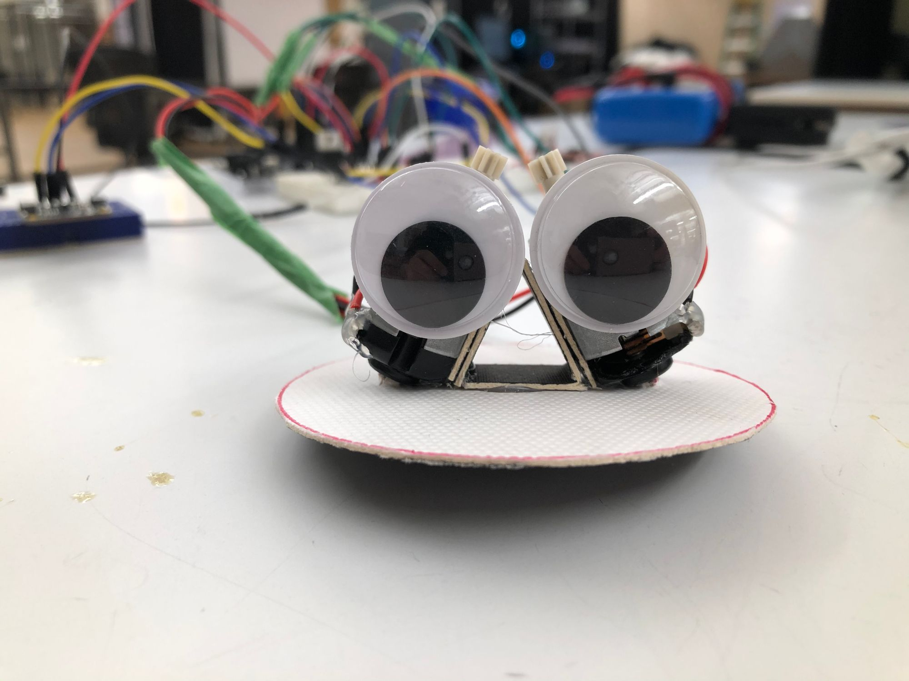
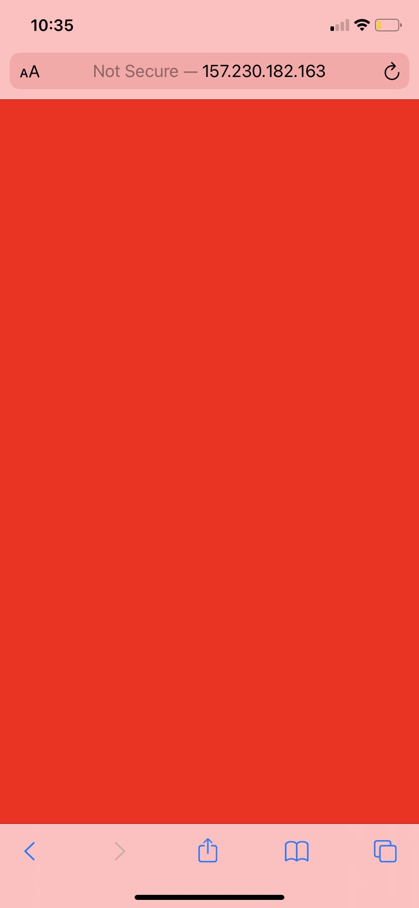
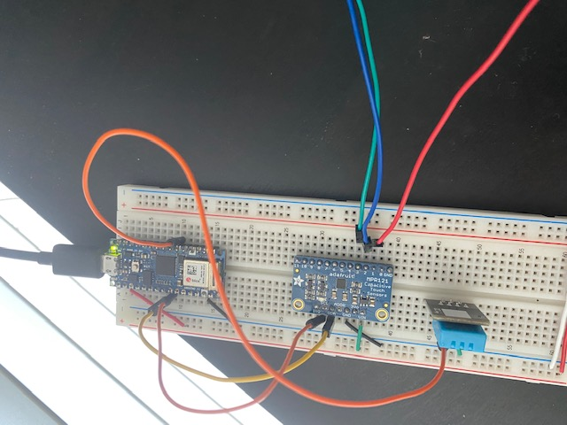

# RoboBull

Daniel and I came up with a telerobot bull idea. The bull will react to colors on a screen. Initially, we are using red. As the project progress, we will add more colors. 

Daniel will build the physical computing part of the robot. I will mainly focus on the remote control of the robot. 



## MQTT Server

 MQTT is an OASIS standard messaging protocol for the Internet of Things (IoT). It is designed as an extremely lightweight publish/subscribe messaging transport that is ideal for connecting remote devices with a small code footprint and minimal network bandwidth. 

 I had a device that sends my room temperature and humidity to an MQTT server. I can use this as starting point of our project. The room humidity usually is 38, but When I hold my hand close to the sensor, the humidity will increase to 70. I can use a humidity sensor as a controller.

 ## Inital Design

 I think the best way to controll a robot from remote will be using websites so I will publish a website which reads sensor value from mqtt server. When humidity is larger than 40, website will change color to red. 

 I developed a endpoint which can query data from mqtt server's database using postgres and node.js. I used this query to select data

 ```sql
 SELECT time_bucket('2 second', recorded_at) as    recorded_at, avg(reading) as humidity
FROM sensor_data
WHERE measurement = 'humidity'
AND device = 23
GROUP BY 1
 ```
And from the front end. It will fetch this end point and read the value that end point returned. 



## Further Development

 I think the best way to control a robot from a remote will be using websites so I will publish a website that reads sensor value from the MQTT server. When humidity is larger than 40, a website will change color to red.

I used a touch sensor for color-changing. Each port from 1 to 3 will correspond to red blue and green and after it touched. The sensor will send an integer value to the MQTT server and this value will get read from my website. 

The remote controller always has some latency, so it took some time for Daniel to see the color. I guess this is something we can not avoid.

